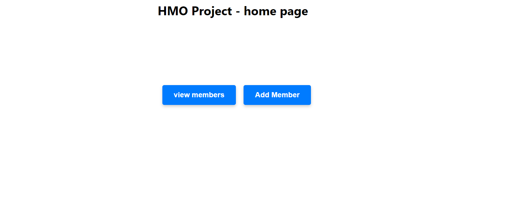
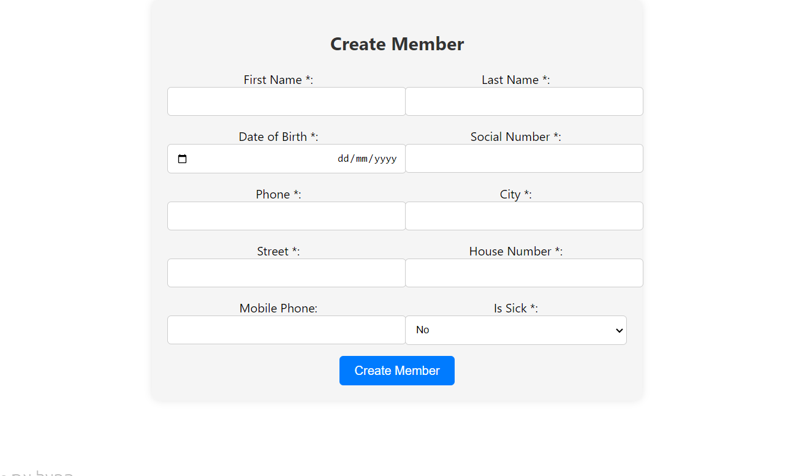
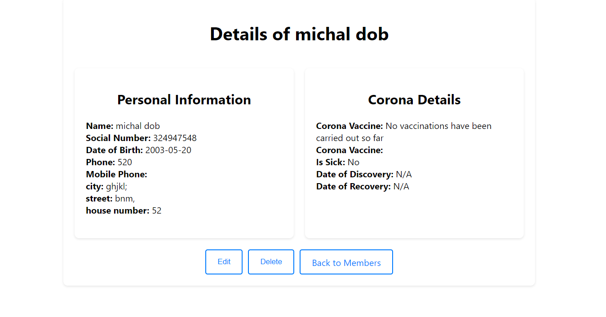
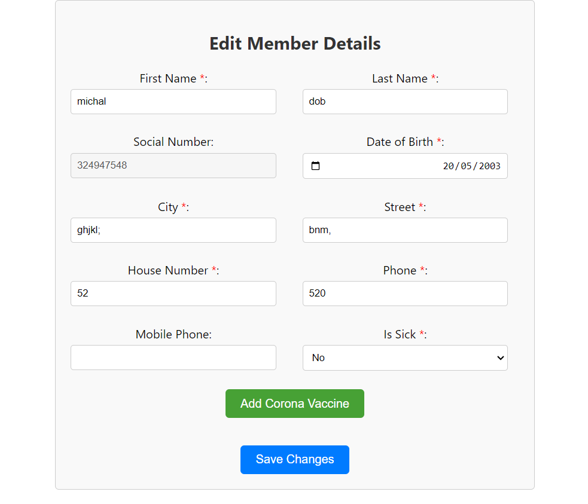

# HMO Project

## Project Overview
This project consists of a server side and a client side
The server side is built in python and connected to a sqlite database
The client side is built from React TypeScript

The application displays the list of members of the health insurance funds
Includes data on the corona virus
You can add a health insurance member, edit details and delete
Here are the

## external dependencies:

node.js, npm

## main screenshots:
Homescreen:

Add New Member:

ViewMember:

Edit Member:

UpdateMember:

